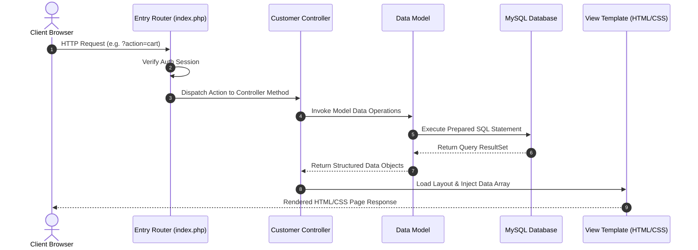

# 🍔 FoodPathai - Secure Customer Portal

[](https://www.php.net/)
[](https://www.mysql.com/)
[](https://developer.mozilla.org/en-US/docs/Web/JavaScript)
[](https://en.wikipedia.org/wiki/Model%E2%80%93view%E2%80%93controller)

Welcome to the **Customer Portal** module of the Online Food Ordering System. This subsystem is a secure, decoupled, and robust MVC (Model-View-Controller) application designed for seamless customer interactions, restaurant exploration, real-time AJAX cart manipulations, and asynchronous delivery tracking.

---

## ✨ Features Showcase

### 🔐 1. Secure Authentication & Session Safeguards
* **Encrypted Credentials:** Implements state-of-the-art secure password hashing using the `BCrypt` algorithm (`password_hash` & `password_verify`).
* **Front Controller Authorization:** All customer actions are routed through a central entrance (`index.php`) which dynamically validates role permissions (`$_SESSION['role'] === 'customer'`), blocking unauthorized guests or cross-portal agents.

### 🏠 2. Interactive Restaurant & Catalog Explorer
* **Dashboard Explorer:** Renders active, approved restaurants alongside their average user reviews, calculated live using aggregate database joins.
* **Menu Catalogs:** Displays nested item categories with prices, detail cards, and contextual operational indicators (Add-to-cart controls are dynamically disabled if a restaurant toggles to 'closed' status).
* **Saved Favourites:** Customers can toggle restaurant saves, instantly persisting them to the database using background AJAX requests.

### 🛒 3. Dynamic AJAX-Driven Shopping Cart
* **In-Memory Sessions:** Keeps active shopping items, quantities, and price mappings cached inside `$_SESSION['cart']` as nested associative arrays, maximizing performance and avoiding expensive database roundtrips.
* **Non-Blocking UI Updates:** Adding, removing, or modifying item quantities instantly updates navigation badges and summary totals using the ES6 Javascript `Fetch API` communicating with `AjaxController.php`.

### 📍 4. Normalized Address & Profile Ledger
* **One-to-Many Address Mapping:** Implements database normalization (1NF) allowing customers to store multiple active delivery address profiles (Home, Office, Work) in a separate `addresses` table.
* **Interactive Profile Panel:** Secure credential adjustment forms and active contact detail management.

### 💳 5. Secure Checkout Pipeline & Transaction safety
* **Database Transactions:** Employs MySQL ACID compliant transactions (`begin_transaction()`, `commit()`, `rollback()`) to ensure checkout records for `orders` and multiple distinct `order_items` are written successfully as a single atomic operation.
* **Validation Guards:** Rigorous checks verify the cart is not empty, payment type is valid, and a registered address is selected before triggering an order insertion.

### 📈 6. Real-Time Order Tracking (AJAX Polling)
* **Status Progress Flow:** Offers an interactive stage-indicator showing the preparation progress (`Pending` → `Preparing` → `On the way` → `Delivered`).
* **Asynchronous Polling:** Leverages Javascript `setInterval` to poll the database via async endpoints every few seconds, updating progress bars and courier stages dynamically without manual webpage reloads.

### 💬 7. Closed-Loop Feedback & Disputes
* **Double-Blind Review Submissions:** Customers can submit 5-star ratings and text reviews for completed order shipments.
* **Complaint Loggers:** Logs customer disputes with admins directly linked to specific order tracking IDs.

---

## 🗺️ System Architecture



### 📂 Directory Structures
```
customer/
├── index.php                 # Core Router and Portal Gatekeeper
├── config/
│   └── database.php          # Object-Oriented MySQLi connection
├── controllers/              # Controller Logic Layer
│   ├── AuthController.php    # Handles logins, registers, and logouts
│   ├── CustomerController.php# Coordinates main page renderings (Dashboard, Favourites)
│   ├── OrderController.php   # Coordinates order creation and real-time trackers
│   └── AjaxController.php    # Direct API endpoints returning JSON for async actions
├── models/                   # Database Models (Data Access Object Layer)
│   ├── User.php              # Secure user credentials database mappings
│   ├── Restaurant.php        # Dynamic ratings aggregator queries
│   ├── SavedRestaurant.php   # Junction table many-to-many favorites toggles
│   ├── Address.php           # Delivery address ledgers
│   ├── Order.php             # Transaction safe checkout queries
│   ├── Review.php            # Customer order review writes
│   └── Complaint.php         # Customer disputation logs
└── views/                    # Layout templates & Content Panels
    ├── layouts/              # DRY navigation headers and footer blocks
    ├── auth/                 # Sign-in and Sign-up panels
    └── customer/             # Feature views (Cart, Tracking, Checkout, Profile)
```

---

## 💾 Core Database Schema Mapping

```sql
-- 1. Users Table (Customer entity authentication)
CREATE TABLE `users` (
  `id` INT AUTO_INCREMENT PRIMARY KEY,
  `name` VARCHAR(100) NOT NULL,
  `email` VARCHAR(100) UNIQUE NOT NULL,
  `password` VARCHAR(255) NOT NULL,
  `phone` VARCHAR(15) NOT NULL,
  `role` ENUM('customer', 'restaurant_manager', 'delivery_agent', 'admin') DEFAULT 'customer',
  `created_at` TIMESTAMP DEFAULT CURRENT_TIMESTAMP
);

-- 2. Addresses Table (One-to-Many User Relationship)
CREATE TABLE `addresses` (
  `id` INT AUTO_INCREMENT PRIMARY KEY,
  `customer_id` INT NOT NULL,
  `address_line` TEXT NOT NULL,
  `city` VARCHAR(50) NOT NULL,
  `postal_code` VARCHAR(10) NOT NULL,
  `is_default` TINYINT(1) DEFAULT 0,
  FOREIGN KEY (`customer_id`) REFERENCES `users`(`id`) ON DELETE CASCADE
);

-- 3. Orders Table (Checkout Pipeline Master Record)
CREATE TABLE `orders` (
  `id` INT AUTO_INCREMENT PRIMARY KEY,
  `customer_id` INT NOT NULL,
  `restaurant_id` INT NOT NULL,
  `address_id` INT NOT NULL,
  `total_amount` DECIMAL(10,2) NOT NULL,
  `status` ENUM('Pending', 'Preparing', 'On the way', 'Delivered', 'Cancelled') DEFAULT 'Pending',
  `created_at` TIMESTAMP DEFAULT CURRENT_TIMESTAMP,
  FOREIGN KEY (`customer_id`) REFERENCES `users`(`id`),
  FOREIGN KEY (`address_id`) REFERENCES `addresses`(`id`)
);
```

---

## 🛠️ Local Installation & Setup

### 📋 Prerequisites
* **Local Web Server:** Apache + PHP (v8.0 or newer)
* **Database Engine:** MySQL / MariaDB
* Recommended stack: [XAMPP](https://www.apachefriends.org/) or [WampServer](https://www.wampserver.com/)

### 🚀 Step-by-Step Installation
1. **Clone the Repository:**
   Clone the repository to your root web directory (e.g., `C:/xampp/htdocs/Food_Order/`).
   ```bash
   cd C:/xampp/htdocs/
   git clone https://github.com/yourusername/Food_Order.git
   ```

2. **Boot Database Engine:**
   Open XAMPP Control Panel and start the **Apache** and **MySQL** modules.

3. **Initialize Database and Seed Data:**
   The project contains a zero-configuration auto-installer database script. Run it directly in your browser:
   ```
   http://localhost/Food_Order/site_agent/setup.php
   ```
   *This automatically builds the database `online_food_ordering_system`, maps foreign key constraints, and seeds standard mock restaurants and menu items.*

4. **Access the Customer Portal:**
   Once setup completes, navigate to the customer entrance:
   ```
   http://localhost/Food_Order/customer/index.php
   ```

---

## 📝 Viva Preparation & Code Study Guide
Are you preparing for an academic presentation, code review, or oral exam?
We have compiled an exhaustive **[customer/VIVA_GUIDE.md](file:///g:/XAMPP/htdocs/Food_Order/customer/VIVA_GUIDE.md)**!

This guide includes:
* **The Entire Consolidated Codebase** in a single file for high-speed scrolling and quick review.
* **Extensive Theoretical Explanations** detailing the design choices, MVC architectures, and data security decisions.
* **Oral Exam Questions & Answers** matching every source file to help you ace your evaluation.
